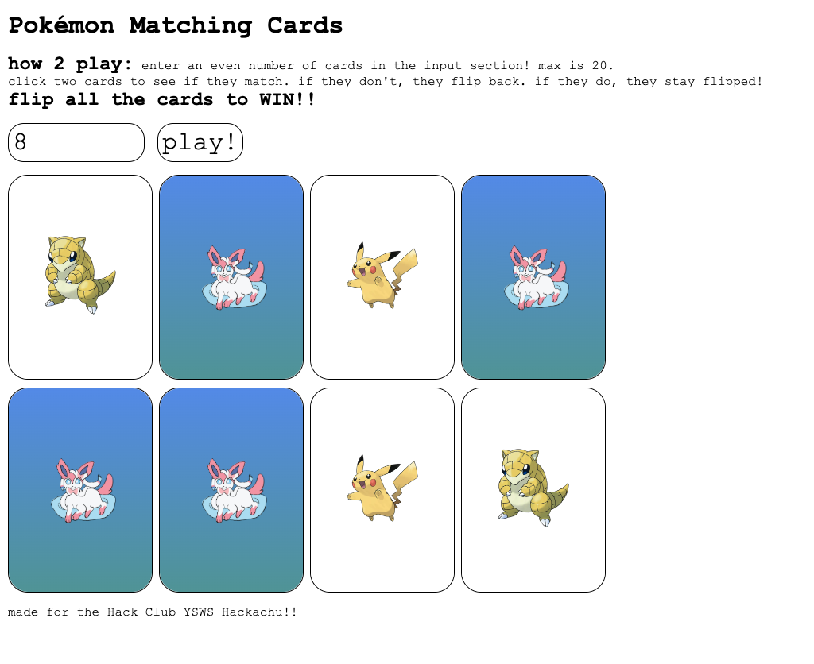

# Pokémon Matching Game
A matching-card game using the first 29 Pokémon from the Pokédex.

## Open the link to play it: [Try it here](https://perplexingpenguin.github.io/card-game/) 

Features:
- ability to set any amount of cards (<=20)
- art from the Pokémon website
- fun card backing with original art!

Made w/ HTML and CSS,
for Hackachu: a Hack Club YSWS!

